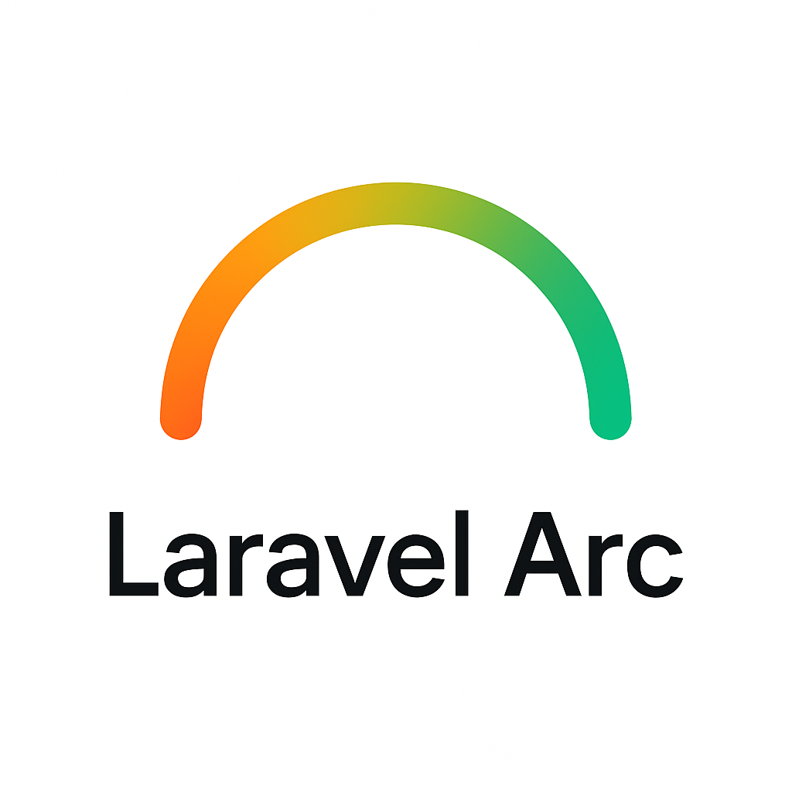

# Laravel Arc



Generate modern, type-safe Data Transfer Objects (DTOs) in Laravel from clean YAML definitions — with automatic validation, nested support, and fluent collection handling.

[](https://packagist.org/packages/grazulex/laravel-arc)
[](https://packagist.org/packages/grazulex/laravel-arc)
[](https://github.com/Grazulex/laravel-arc/blob/main/LICENSE.md)
[](https://php.net/)
[](https://laravel.com/)
[](https://github.com/Grazulex/laravel-arc/actions)
[](https://github.com/laravel/pint)

## Overview

Laravel Arc is a powerful Laravel package that simplifies Data Transfer Object (DTO) management through YAML-driven generation. Define your DTOs in simple YAML files and let Laravel Arc generate type-safe, validated PHP classes with automatic property access and comprehensive collection support.

**Think of it as Laravel API Resources, but with stronger typing, automatic validation, and generated from YAML definitions.**

### 🎯 Key Features

- **🏗️ YAML-Driven Generation** - Define DTOs in clean, readable YAML
- **🔒 Type Safety** - Full PHP 8.3+ type enforcement with readonly properties
- **✅ Automatic Validation** - Generate Laravel validation rules from field definitions
- **🔄 Field Transformers** - Built-in data transformation (trim, slugify, normalize, etc.)
- **📊 Export Formats** - Convert to JSON, XML, CSV, YAML, and more
- **🎯 Behavioral Traits** - Timestamps, UUIDs, soft deletes, and tagging
- **🚀 Modern PHP** - Leverages PHP 8.3+ features and best practices

### 📚 Complete Documentation

**➡️ [Visit the Wiki for complete documentation, examples, and guides](https://github.com/Grazulex/laravel-arc/wiki)**

The wiki contains:
- **[Getting Started Guide](https://github.com/Grazulex/laravel-arc/wiki/GETTING_STARTED)**
- **[Field Types & Transformers](https://github.com/Grazulex/laravel-arc/wiki/FIELD_TYPES)**
- **[Advanced Features](https://github.com/Grazulex/laravel-arc/wiki/ADVANCED_USAGE)**
- **[API Reference](https://github.com/Grazulex/laravel-arc/wiki/CLI_COMMANDS)**
- **[Examples & Recipes](https://github.com/Grazulex/laravel-arc/wiki/examples/README)**

## 📦 Quick Installation

```bash
composer require grazulex/laravel-arc
php artisan vendor:publish --provider="Grazulex\LaravelArc\LaravelArcServiceProvider"
```

## 🚀 Quick Start

1. **Create a DTO definition:**
```bash
php artisan dto:definition-init UserDTO --model=App\\Models\\User --table=users
```

2. **Generate the DTO class:**
```bash
php artisan dto:generate user.yaml
```

3. **Use your DTO:**
```php
$userData = ['name' => 'John Doe', 'email' => 'john@example.com'];
$userDto = UserDTO::fromArray($userData);

echo $userDto->name; // 'John Doe'
echo $userDto->toJson(); // JSON representation
```

## 📖 Learn More

- **[📚 Complete Documentation](https://github.com/Grazulex/laravel-arc/wiki)** - Full guides and API reference
- **[🚀 Getting Started](https://github.com/Grazulex/laravel-arc/wiki/GETTING_STARTED)** - Installation and first steps
- **[💡 Examples](https://github.com/Grazulex/laravel-arc/wiki/examples/README)** - Real-world usage examples
- **[🔧 Advanced Features](https://github.com/Grazulex/laravel-arc/wiki/ADVANCED_USAGE)** - Transformers, traits, and more

## 🔧 Requirements

- **PHP:** ^8.3
- **Laravel:** ^12.19
- **Carbon:** ^3.10

## 🧪 Testing

```bash
composer test
```

## 🤝 Contributing

We welcome contributions! Please see our [Contributing Guide](CONTRIBUTING.md) for details.

## 🔒 Security

Please review our [Security Policy](SECURITY.md) for reporting vulnerabilities.

## 📄 License

Laravel Arc is open-sourced software licensed under the [MIT license](LICENSE.md).

---

**Made with ❤️ by [Jean-Marc Strauven](https://github.com/Grazulex)**