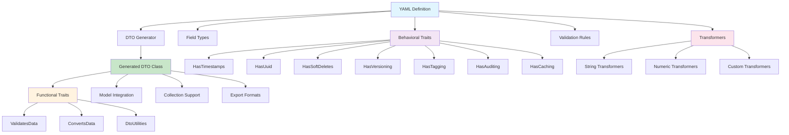

# Laravel Arc

<div align="center">
  
  <p><strong>Generate modern, type-safe Data Transfer Objects (DTOs) in Laravel from clean YAML definitions — with automatic validation, nested support, and fluent collection handling.</strong></p>
  
  [](https://packagist.org/packages/grazulex/laravel-arc)
  [](https://packagist.org/packages/grazulex/laravel-arc)
  [](LICENSE.md)
  [](https://php.net)
  [](https://laravel.com)
  [](https://github.com/Grazulex/laravel-arc/actions)
  [](https://github.com/laravel/pint)
</div>

## Overview

<div style="background: linear-gradient(135deg, #FF9900 0%, #D2D200 25%, #88C600 75%, #00B470 100%); padding: 20px; border-radius: 10px; margin: 20px 0; color: #ffffff; text-shadow: 1px 1px 2px rgba(0,0,0,0.5);">

**Laravel Arc** is a powerful Laravel package that simplifies Data Transfer Object (DTO) management through YAML-driven generation. Define your DTOs in simple YAML files and let Laravel Arc generate type-safe, validated PHP classes with automatic property access and comprehensive collection support.

**Think of it as Laravel API Resources, but with stronger typing, automatic validation, and generated from YAML definitions.**

</div>

## 🏗️ Architecture



## <span style="color: #FF9900;">✨</span> Key Features

- 🚀 **<span style="color: #FF9900;">YAML-driven generation</span>** - Define DTOs in simple, readable YAML files
- 🔍 **<span style="color: #D2D200;">Automatic validation</span>** - Built-in Laravel validation rules support
- 🏗️ **<span style="color: #88C600;">Rich field types</span>** - 14+ field types including enums, UUIDs, nested DTOs, and JSON
- 🔗 **<span style="color: #00B470;">Eloquent relationships</span>** - Full support for Laravel relationship types
- ⚡ **<span style="color: #FF9900;">Direct property access</span>** - Clean, modern syntax with PHP 8.3+ features
- 📦 **<span style="color: #D2D200;">Collection management</span>** - Convert models to DTO collections like Laravel Resources
- 🎯 **<span style="color: #88C600;">Powerful trait system</span>** - Built-in behavioral traits for common functionality (HasTimestamps, HasUuid, HasSoftDeletes, HasVersioning, HasTagging, HasAuditing, HasCaching) plus 3 functional traits (ValidatesData, ConvertsData, DtoUtilities) in every DTO
- 🔄 **<span style="color: #00B470;">Field transformers</span>** - Automatically transform field values during DTO creation with 10 built-in transformers (trim, lowercase, uppercase, title_case, slugify, abs, encrypt, normalize_phone, clamp_max, clamp_min)
- 📤 **<span style="color: #FF9900;">Multiple export formats</span>** - Export DTOs in 9 formats (JSON, YAML, CSV, XML, TOML, Markdown, PHP Array, Query String, MessagePack) with dedicated collection methods
- 🛠️ **<span style="color: #D2D200;">Powerful CLI commands</span>** - Generate, list, and manage DTOs from the command line
- 📁 **<span style="color: #88C600;">Smart path resolution</span>** - Automatic namespace-to-path conversion with custom organization
- 🚨 **<span style="color: #00B470;">Enhanced error handling</span>** - Detailed error messages with actionable suggestions
- 📦 **<span style="color: #FF9900;">Zero configuration</span>** - Works out of the box with sensible defaults
- 🧪 **<span style="color: #D2D200;">Fully tested</span>** - Comprehensive test suite with high coverage

## <span style="color: #FF9900;">🚀</span> Quick Start

### <span style="color: #D2D200;">Installation</span>

```bash
composer require grazulex/laravel-arc
```

### <span style="color: #88C600;">Basic Usage</span>

**<span style="color: #FF9900;">1. Create a DTO definition</span>**
```bash
php artisan dto:definition-init UserDTO --model=App\\Models\\User --table=users
```

**<span style="color: #D2D200;">2. Define your DTO in YAML</span>**
```yaml
# dto-definitions/UserDTO.yaml
header:
  dto: UserDTO
  namespace: App\DTO
  model: App\Models\User
  traits:
    - HasTimestamps
    - HasUuid

fields:
  name:
    type: string
    validation: [required, string, max:255]
    transformers: [trim, title_case]
  
  email:
    type: string
    validation: [required, email]
    transformers: [trim, lowercase]
  
  status:
    type: string
    default: "active"
    validation: [required, in:active,inactive]
```

**<span style="color: #88C600;">3. Generate your DTO</span>**
```bash
php artisan dto:generate UserDTO.yaml
```

**<span style="color: #00B470;">4. Use your DTO</span>**
```php
// Convert a model to DTO
$user = User::find(1);
$userDto = UserDTO::fromModel($user);

// Convert a collection to DTO collection (like Laravel Resources)
$users = User::all();
$userDtos = UserDTO::collection($users); // Returns DtoCollection
// OR
$userDtos = UserDTO::fromModels($users); // Alternative syntax

// API Resource format
return response()->json($userDtos->toArrayResource());
// Output: {"data": [{"id": 1, "name": "John", "email": "john@example.com", "status": "active"}]}

// Export in multiple formats - 9 formats available
$json = $userDto->toJson();
$yaml = $userDto->toYaml();
$csv = $userDto->toCsv();
$xml = $userDto->toXml();
$toml = $userDto->toToml();
$markdown = $userDto->toMarkdownTable();
$phpArray = $userDto->toPhpArray();
$queryString = $userDto->toQueryString();
$messagepack = $userDto->toMessagePack();
$collection = $userDto->toCollection();

// Collection exports (with data wrapper like Laravel Resources)
$jsonData = UserDTO::collectionToJson($users);
$csvData = UserDTO::collectionToCsv($users);
$xmlData = UserDTO::collectionToXml($users);
$yamlData = UserDTO::collectionToYaml($users);
$markdownData = UserDTO::collectionToMarkdownTable($users);

// Validation
$userDto = UserDTO::fromArray($request->all());
if (!$userDto->isValid()) {
    return response()->json(['errors' => $userDto->getErrors()], 422);
}
```

## <span style="color: #88C600;">🎯</span> Traits System

> **<span style="color: #FF9900;">💡</span>** Laravel Arc provides a powerful trait system with two types of traits:

### <span style="border-left: 4px solid #FF9900; padding-left: 10px;">Functional Traits (Automatic)</span>
Every DTO automatically includes these three powerful traits:
- **<span style="color: #FF9900;">ValidatesData</span>** - Provides validation methods (`validate()`, `passes()`, `fails()`)
- **<span style="color: #D2D200;">ConvertsData</span>** - Provides conversion methods (`toJson()`, `toCsv()`, `toXml()`, etc.)
- **<span style="color: #88C600;">DtoUtilities</span>** - Provides utility methods (`getProperties()`, `with()`, `equals()`)

### <span style="border-left: 4px solid #00B470; padding-left: 10px;">Behavioral Traits (Optional) - 7 Available Traits</span>
Add specific functionality by including traits in your YAML definition:

```yaml
header:
  traits:
    - HasTimestamps    # Adds created_at, updated_at fields and methods
    - HasUuid         # Adds id field with UUID validation
    - HasSoftDeletes  # Adds deleted_at field for soft deletes
    - HasVersioning   # Adds version field and versioning methods
    - HasTagging      # Adds tags field and tagging methods
    - HasAuditing     # Adds audit trail fields and methods
    - HasCaching      # Adds caching capabilities
```

**<span style="color: #00B470;">Example usage:</span>**
```php
// Using functional traits (automatic)
$userDto = UserDTO::fromArray($data);
if (UserDTO::passes($data)) {
    $validated = UserDTO::validate($data);
}

// Using behavioral traits (if included)
$userDto = $userDto->addTag('premium')
                  ->nextVersion()
                  ->touch()
                  ->cache(3600);
```

## <span style="color: #00B470;">🔄</span> Field Transformers

Automatically transform field values during DTO creation:

```yaml
fields:
  name:
    type: string
    transformers: [trim, title_case]  # "  john doe  " → "John Doe"
  
  email:
    type: string
    transformers: [trim, lowercase]   # "  JOHN@EXAMPLE.COM  " → "john@example.com"
  
  price:
    type: decimal
    transformers: [abs, clamp_min:0]  # -19.99 → 19.99
```

**<span style="color: #88C600;">Available transformers:</span>**
- **<span style="color: #FF9900;">String transformers</span>**: `trim`, `lowercase`, `uppercase`, `title_case`, `slugify`
- **<span style="color: #D2D200;">Numeric transformers</span>**: `abs`, `clamp_max`, `clamp_min`
- **<span style="color: #00B470;">Security transformers</span>**: `encrypt`
- **<span style="color: #88C600;">Phone transformers</span>**: `normalize_phone` (adds +33 prefix for French numbers starting with 0)

## <span style="color: #D2D200;">📖</span> Documentation

**<span style="color: #FF9900;">Complete documentation and guides:</span>**
- **[📖 Documentation Index](docs/README.md)** - Complete navigation guide
- **[🚀 Getting Started](docs/GETTING_STARTED.md)** - Installation and first DTO
- **[📘 DTO Usage Guide](docs/DTO_USAGE_GUIDE.md)** - How to use DTOs in your Laravel application
- **[🎯 Examples Collection](examples/README.md)** - Working examples and templates

### <span style="border-left: 3px solid #88C600; padding-left: 8px;">Core Concepts</span>
- **[YAML Schema](docs/YAML_SCHEMA.md)** - Full YAML configuration reference
- **[Field Types](docs/FIELD_TYPES.md)** - All available field types and options
- **[Traits Guide](docs/TRAITS_GUIDE.md)** - Functional and behavioral traits system
- **[Validation Rules](docs/VALIDATION_RULES.md)** - Custom validation and error handling

### <span style="border-left: 3px solid #00B470; padding-left: 8px;">Advanced Features</span>
- **[Collection Management](docs/COLLECTION_MANAGEMENT.md)** - Working with DTO collections and API resources
- **[Export Formats](docs/EXPORT_FORMATS.md)** - Export DTOs in 10 different formats
- **[Field Transformers](docs/FIELD_TRANSFORMERS.md)** - Automatic field value transformation
- **[Relationships](docs/RELATIONSHIPS.md)** - Eloquent relationships in DTOs
- **[Nested DTOs](docs/NESTED_DTO_GUIDE.md)** - Building complex nested structures
- **[CLI Commands](docs/CLI_COMMANDS.md)** - All available Artisan commands
- **[Advanced Usage](docs/ADVANCED_USAGE.md)** - Advanced patterns and customizations

## <span style="color: #88C600;">🎯</span> Use Cases

Laravel Arc is perfect for:

- **<span style="color: #FF9900;">API Development</span>** - Type-safe request/response handling
- **<span style="color: #D2D200;">Data Validation</span>** - Consistent validation across your application
- **<span style="color: #88C600;">Model Transformation</span>** - Clean data layer separation
- **<span style="color: #00B470;">Complex Forms</span>** - Nested form validation and processing
- **<span style="color: #FF9900;">API Resources</span>** - Alternative to Laravel Resources with stronger typing

## <span style="color: #00B470;">⚙️</span> Configuration

Laravel Arc works out of the box, but you can customize it:

```php
// config/dto.php
return [
    'definitions_path' => base_path('database/dto_definitions'),
    'output_path' => base_path('app/DTO'),
];
```

## <span style="color: #D2D200;">📚</span> Examples

Check out the [examples directory](examples/) for complete working examples:
- **[<span style="color: #FF9900;">Basic User DTO</span>](examples/user.yaml)** - Simple user DTO with validation
- **[<span style="color: #88C600;">API Controllers</span>](examples/api-controller-example.php)** - Using DTOs in API controllers
- **[<span style="color: #00B470;">Export Formats</span>](examples/export-formats-example.php)** - Export DTOs in 9 different formats
- **[<span style="color: #D2D200;">Collection Methods</span>](examples/collection-methods-example.php)** - Advanced collection management
- **[<span style="color: #FF9900;">Nested Structures</span>](examples/nested-order.yaml)** - Complex nested DTOs
- **[<span style="color: #88C600;">Enum Support</span>](examples/enum-examples.yaml)** - Working with PHP enums

## <span style="color: #88C600;">🤝</span> Contributing

We welcome contributions! Please see our [Contributing Guide](CONTRIBUTING.md) for details.

## <span style="color: #FF9900;">📄</span> License

Laravel Arc is open-sourced software licensed under the [MIT license](LICENSE.md).

---

<div align="center">
  Made with <span style="color: #FF9900;">❤️</span> for the <span style="color: #88C600;">Laravel</span> community
</div>