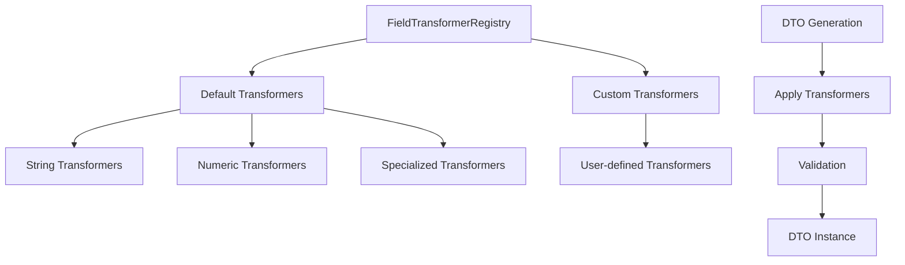
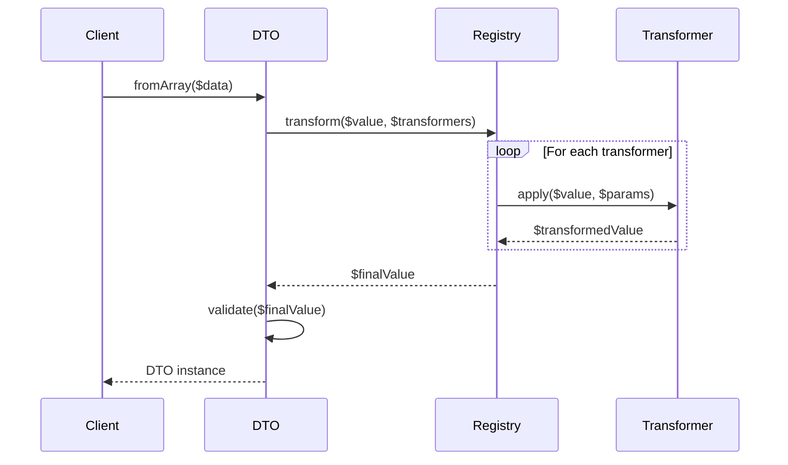

# Field Transformers Guide

<div align="center">
  <p><strong>Comprehensive guide to Laravel Arc's field transformation system</strong></p>
</div>

Field transformers allow you to automatically transform field values during DTO creation. Transformers are applied before validation and can be chained together for complex data processing.

## 📋 Table of Contents

- [Overview](#overview)
- [Available Transformers](#available-transformers)
- [Usage Examples](#usage-examples)
- [Chaining Transformers](#chaining-transformers)
- [Custom Transformers](#custom-transformers)
- [Best Practices](#best-practices)
- [Architecture](#architecture)

## Overview

Field transformers provide a declarative way to clean, format, and normalize data before it's validated and stored in DTOs. They help ensure data consistency and reduce the need for manual data processing.

### Key Benefits

- ✅ **Automatic data cleaning** - Remove whitespace, normalize formats
- ✅ **Consistent formatting** - Ensure uniform data presentation
- ✅ **Validation preparation** - Transform data before validation rules are applied
- ✅ **Chainable operations** - Apply multiple transformers in sequence
- ✅ **Reusable logic** - Define transformations once, use everywhere
- ✅ **Performance optimized** - Transformers are applied efficiently during DTO creation

## Available Transformers

### String Transformers

| Transformer | Description | Input | Output |
|-------------|-------------|--------|--------|
| `trim` | Removes whitespace from strings | `"  hello  "` | `"hello"` |
| `lowercase` | Converts to lowercase | `"Hello World"` | `"hello world"` |
| `uppercase` | Converts to uppercase | `"hello world"` | `"HELLO WORLD"` |
| `title_case` | Converts to title case | `"hello world"` | `"Hello World"` |
| `slugify` | Creates URL-friendly slugs | `"Hello World!"` | `"hello-world"` |
| `encrypt` | Encrypts string values | `"secret"` | `"encrypted_value"` |

### Numeric Transformers

| Transformer | Description | Input | Output |
|-------------|-------------|--------|--------|
| `abs` | Returns absolute value | `-5` | `5` |
| `clamp_max:value` | Limits maximum value | `100` with `clamp_max:50` | `50` |
| `clamp_min:value` | Limits minimum value | `10` with `clamp_min:20` | `20` |

### Specialized Transformers

| Transformer | Description | Input | Output |
|-------------|-------------|--------|--------|
| `normalize_phone` | Normalizes phone numbers | `"01 23 45 67 89"` | `"+33123456789"` |

## Usage Examples

### Basic Usage

```yaml
# dto-definitions/UserDTO.yaml
header:
  dto: UserDTO
  namespace: App\DTOs
  model: App\Models\User

fields:
  name:
    type: string
    validation: [required, string, max:255]
    transformers: [trim, title_case]
  
  email:
    type: string
    validation: [required, email]
    transformers: [trim, lowercase]
  
  slug:
    type: string
    transformers: [slugify]
```

### Advanced Usage with Parameters

```yaml
fields:
  price:
    type: float
    validation: [numeric, min:0]
    transformers: [abs, clamp_min:0, clamp_max:9999.99]
  
  discount:
    type: float
    validation: [numeric, min:0, max:100]
    transformers: [abs, clamp_min:0, clamp_max:100]
  
  phone:
    type: string
    validation: [required, string]
    transformers: [normalize_phone]
```

### Real-world Examples

#### Product DTO
```yaml
# dto-definitions/ProductDTO.yaml
header:
  dto: ProductDTO
  namespace: App\DTOs
  model: App\Models\Product

fields:
  name:
    type: string
    validation: [required, string, max:255]
    transformers: [trim, title_case]
  
  description:
    type: text
    validation: [string, max:1000]
    transformers: [trim]
  
  slug:
    type: string
    validation: [required, string, unique:products]
    transformers: [slugify]
  
  price:
    type: decimal
    validation: [required, numeric, min:0]
    transformers: [abs]
  
  sku:
    type: string
    validation: [required, string, unique:products]
    transformers: [trim, uppercase]
```

#### User Registration DTO
```yaml
# dto-definitions/UserRegistrationDTO.yaml
header:
  dto: UserRegistrationDTO
  namespace: App\DTOs
  model: App\Models\User

fields:
  first_name:
    type: string
    validation: [required, string, max:100]
    transformers: [trim, title_case]
  
  last_name:
    type: string
    validation: [required, string, max:100]
    transformers: [trim, title_case]
  
  email:
    type: string
    validation: [required, email, unique:users]
    transformers: [trim, lowercase]
  
  phone:
    type: string
    validation: [required, string]
    transformers: [normalize_phone]
  
  company:
    type: string
    validation: [string, max:255]
    transformers: [trim]
```

## Chaining Transformers

Transformers are applied in the order they're specified. This allows for complex data processing pipelines:

```yaml
fields:
  # Clean and format a title
  title:
    type: string
    transformers: [trim, title_case]
  
  # Create a slug from a title
  slug:
    type: string
    transformers: [trim, slugify]
  
  # Clean and constrain a price
  price:
    type: decimal
    transformers: [abs, clamp_min:0, clamp_max:99999.99]
```

### Order Matters

The order of transformers is important:

```yaml
# ✅ Good - trim first, then format
name:
  type: string
  transformers: [trim, title_case]

# ❌ Less optimal - format first, then trim
name:
  type: string
  transformers: [title_case, trim]
```

## Custom Transformers

You can register custom transformers in your application's service provider:

### Registering Custom Transformers

```php
<?php

namespace App\Providers;

use Illuminate\Support\ServiceProvider;
use Grazulex\LaravelArc\Support\Transformers\FieldTransformerRegistry;

class AppServiceProvider extends ServiceProvider
{
    public function boot()
    {
        $registry = app(FieldTransformerRegistry::class);
        
        // Simple transformer
        $registry->register('capitalize_first', function ($value) {
            return is_string($value) ? ucfirst(strtolower($value)) : $value;
        });
        
        // Transformer with parameters
        $registry->register('truncate', function ($value, $length = 100, $suffix = '...') {
            if (!is_string($value) || strlen($value) <= $length) {
                return $value;
            }
            return substr($value, 0, $length) . $suffix;
        });
        
        // Complex transformer
        $registry->register('clean_html', function ($value) {
            return is_string($value) ? strip_tags($value) : $value;
        });
    }
}
```

### Using Custom Transformers

```yaml
fields:
  name:
    type: string
    transformers: [trim, capitalize_first]
  
  description:
    type: text
    transformers: [clean_html, truncate:200]
  
  bio:
    type: text
    transformers: [clean_html, truncate:500,...]
```

### Advanced Custom Transformer Example

```php
<?php

namespace App\Transformers;

class AddressTransformer
{
    public function __invoke($value)
    {
        if (!is_string($value)) {
            return $value;
        }
        
        // Normalize address format
        $value = preg_replace('/\s+/', ' ', trim($value));
        $value = str_replace([' st ', ' St ', ' ST '], ' Street ', $value);
        $value = str_replace([' ave ', ' Ave ', ' AVE '], ' Avenue ', $value);
        $value = str_replace([' blvd ', ' Blvd ', ' BLVD '], ' Boulevard ', $value);
        
        return $value;
    }
}

// Register in service provider
$registry->register('normalize_address', new AddressTransformer());
```

## Best Practices

### 1. Order Transformers Logically

```yaml
# ✅ Good - clean first, then format
fields:
  name:
    transformers: [trim, title_case]
  
  slug:
    transformers: [trim, slugify]
```

### 2. Use Appropriate Transformers for Data Types

```yaml
# ✅ Good - string transformers for strings
email:
  type: string
  transformers: [trim, lowercase]

# ✅ Good - numeric transformers for numbers
price:
  type: decimal
  transformers: [abs, clamp_min:0]
```

### 3. Consider Performance

```yaml
# ✅ Good - simple transformers
name:
  transformers: [trim, title_case]

# ⚠️ Be careful with complex transformers
content:
  transformers: [complex_html_processor]  # Consider performance impact
```

### 4. Test Transformers Thoroughly

```php
<?php

namespace Tests\Unit;

use Tests\TestCase;
use App\DTOs\UserDTO;

class UserDTOTransformersTest extends TestCase
{
    public function test_name_transformer()
    {
        $dto = UserDTO::fromArray([
            'name' => '  john doe  ',
            'email' => 'john@example.com',
        ]);
        
        $this->assertEquals('John Doe', $dto->name);
    }
    
    public function test_email_transformer()
    {
        $dto = UserDTO::fromArray([
            'name' => 'John Doe',
            'email' => '  JOHN@EXAMPLE.COM  ',
        ]);
        
        $this->assertEquals('john@example.com', $dto->email);
    }
}
```

### 5. Document Custom Transformers

```php
/**
 * Normalizes French phone numbers to international format
 * 
 * @param mixed $value The phone number to normalize
 * @return mixed The normalized phone number or original value if not a string
 */
$registry->register('normalize_french_phone', function ($value) {
    // Implementation...
});
```

## Architecture

### Transformer Registry

The `FieldTransformerRegistry` class manages all transformers:



### Transformation Pipeline



### Error Handling

Transformers should be defensive and handle edge cases:

```php
$registry->register('safe_transformer', function ($value) {
    // Always check value type
    if (!is_string($value)) {
        return $value;
    }
    
    try {
        // Perform transformation
        return transform($value);
    } catch (\Exception $e) {
        // Log error and return original value
        \Log::warning('Transformer failed', ['value' => $value, 'error' => $e->getMessage()]);
        return $value;
    }
});
```

## Common Use Cases

### 1. Data Cleaning

```yaml
# Remove whitespace and normalize format
fields:
  name:
    transformers: [trim, title_case]
  email:
    transformers: [trim, lowercase]
```

### 2. URL Generation

```yaml
# Create SEO-friendly URLs
fields:
  title:
    transformers: [trim, title_case]
  slug:
    transformers: [slugify]
```

### 3. Data Validation Preparation

```yaml
# Normalize before validation
fields:
  phone:
    transformers: [normalize_phone]
    validation: [required, string, regex:/^\+\d{11,15}$/]
```

### 4. Security

```yaml
# Clean and encrypt sensitive data
fields:
  credit_card:
    transformers: [trim, encrypt]
    validation: [required, string]
```

### 5. Formatting

```yaml
# Consistent formatting
fields:
  product_code:
    transformers: [trim, uppercase]
    validation: [required, string, regex:/^[A-Z0-9-]+$/]
```

## See Also

- [YAML Schema Reference](YAML_SCHEMA.md) - Complete YAML configuration guide
- [Field Types](FIELD_TYPES.md) - Available field types
- [Validation Rules](VALIDATION_RULES.md) - Validation configuration
- [Traits Guide](TRAITS_GUIDE.md) - Behavioral and functional traits
- [Advanced Usage](ADVANCED_USAGE.md) - Advanced patterns and customizations

---

<div align="center">
  <p><strong>Ready to transform your data?</strong></p>
  <p>Check out the <a href="YAML_SCHEMA.md">YAML Schema Reference</a> for complete configuration options!</p>
</div>